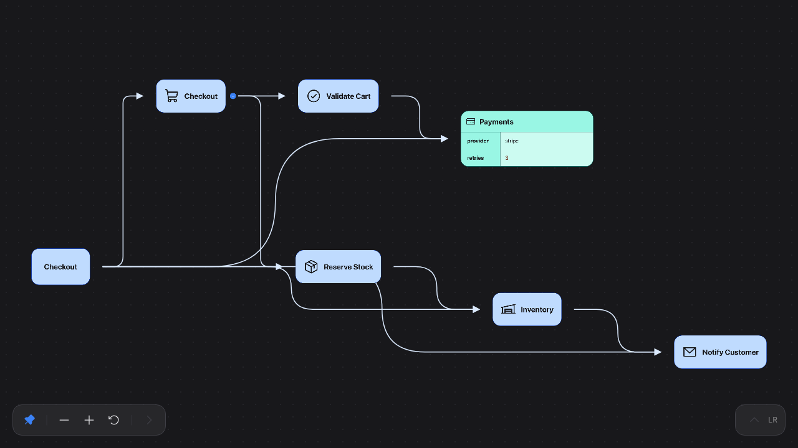

# Squeed Flow

Preview [Squeed](https://github.com/sciphergfx/squeed-flow-sdk) JSON documents as interactive flow diagrams, side by side with the editor.



## Features

- **Open Preview to the Side** from the editor title button, the command palette, or `Ctrl+Shift+V` (`Cmd+Shift+V` on macOS) in a JSON or JSONC file.
- **Live updates** – the diagram re-renders as you type. If the document stops being valid JSON, the last valid diagram stays visible with the parse error shown above it.
- **Interactive** – pan, zoom, expand and collapse branches, switch layout direction, and try the node and edge tools. Double-click a node label to edit it inline, or select a node and use the bottom toolbar's **Node label** field. Press Enter or move focus away to apply an inline edit; Escape cancels it. The preview never writes to your file; edits made in the pane are discarded when the document changes.
- **Follows your theme** – light and dark color modes track the active VS Code theme.
- **Restored on reload** – open preview panes come back when the window is reloaded.

## Squeed JSON

Any JSON object or array renders. Keys become nodes, nesting becomes hierarchy, and `$` keys configure appearance:

```json
{
  "service": {
    "$label": "Service",
    "$icon": "PiBookOpen",
    "$collapsed": false,
    "worker": { "$label": "Worker", "$target": "root.database" }
  },
  "database": { "$label": "Database" }
}
```

See the [`@squeed/flow-sdk` README](https://github.com/sciphergfx/squeed-flow-sdk#readme) for the full set of keys (`$label`, `$icon`, `$content`, `$bgColor`, `$collapsed`, `$target`, `$connections`, …).

Icon names from the Phosphor family (`Pi…`) are bundled; names from other `react-icons` families render without an icon to keep the extension small.

## Commands

| Command                                  | Description                                          |
| ---------------------------------------- | ---------------------------------------------------- |
| `Squeed Flow: Open Preview to the Side`  | Open (or reveal) the preview for the active document |

## Development

```sh
npm install
npm run build              # typecheck + bundle extension host and webview
npm test                   # build, then headless Chromium smoke test of the webview
npm run test:integration   # downloads a VS Code build and exercises the command/panel lifecycle
npm run test:e2e           # drives that VS Code build with Playwright and checks the rendered diagram
npm run package            # produce a .vsix
```

Press `F5` to launch the Extension Development Host with the SDK examples folder open.

## License

AGPL-3.0. The bundled `@squeed/flow-sdk` is also AGPL-3.0.
